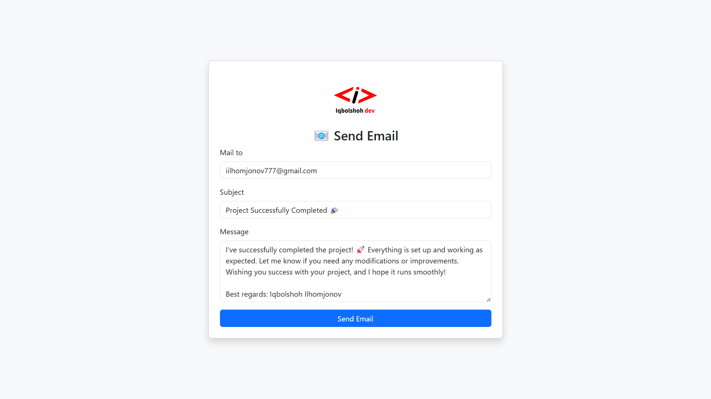

# 📧 PHP Mailer - Email Sending System

This project allows users to send emails via **SMTP server** using **PHP** and the **PHPMailer** library. It features a clean **Bootstrap** UI and uses **SweetAlert2** for better user experience.



## 📌 Features
✔ **Send emails via SMTP** 📧  
✔ **CSRF protection for security** 🔐  
✔ **SweetAlert2 for user notifications** 💡  
✔ **Responsive UI with Bootstrap** 🎨  
✔ **AJAX support for seamless requests** ⚡

## 🎯 Workflow Overview
1️⃣ **User** fills out the email form and submits.  
2️⃣ **JavaScript fetch API** sends data to `send-mail.php`.  
3️⃣ **PHP backend** validates data, checks CSRF token, and sends an email using PHPMailer.  
4️⃣ **SweetAlert2** displays a success/failure notification.  

## 📂 Project Structure
```
/project-root
│── /src/images/logo.svg      # Project logo
│── /vendor                   # Composer dependencies
│── index.php                 # Frontend
│── send-mail.php             # Backend logic for sending emails
│── composer.json             # Composer configuration
│── README.md                 # Documentation
```

## 🚀 Setup & Installation

1️⃣ Clone the repository:
```bash
git clone https://github.com/Iqbolshoh/php-send-mail.git
```

2️⃣ Navigate to the project directory:
```bash
cd php-mailer
```

3️⃣ Install dependencies via Composer:
```bash
composer install
```

4️⃣ Configure your SMTP settings in `send-mail.php`:
```php
// SMTP Server Configuration
define('SMTP_HOST', 'mail.yourdomain.com');
define('SMTP_USER', 'your-email@yourdomain.com');
define('SMTP_PASS', 'your-email-password');
define('SMTP_PORT', 465); // 465 for SSL, 587 for TLS
```

5️⃣ Run the project on a local server:
```bash
php -S localhost:8000
```

6️⃣ Open your browser and go to:
```
http://localhost:8000/
```
---

## 🖥 Technologies Used
<div style="display: flex; flex-wrap: wrap; gap: 5px;">
    
    
    
    
    
</div>

---

## 📜 License
This project is open-source and available under the **MIT License**.

## 🤝 Contributing  
🎯 Contributions are welcome! If you have suggestions or want to enhance the project, feel free to fork the repository and submit a pull request.

## 📬 Connect with Me  
💬 I love meeting new people and discussing tech, business, and creative ideas. Let’s connect! You can reach me on these platforms:

<div align="center">
  <table>
    <tr>
      <td>
        <a href="https://iqbolshoh.uz" target="_blank">
          
        </a>
      </td>
      <td>
        <a href="mailto:iilhomjonov777@gmail.com" target="_blank">
          
        </a>
      </td>
      <td>
        <a href="https://github.com/iqbolshoh" target="_blank">
          
        </a>
      </td>
      <td>
        <a href="https://www.linkedin.com/in/iqbolshoh/" target="_blank">
          
        </a>
      </td>
      <td>
        <a href="https://t.me/iqbolshoh_777" target="_blank">
          
        </a>
      </td>
      <td>
        <a href="https://wa.me/998997799333" target="_blank">
          
        </a>
      </td>
      <td>
        <a href="https://instagram.com/iqbolshoh_777" target="_blank">
          
        </a>
      </td>
      <td>
        <a href="https://x.com/iqbolshoh_777" target="_blank">
          
        </a>
      </td>
      <td>
        <a href="https://www.youtube.com/@Iqbolshoh_777" target="_blank">
          
        </a>
      </td>
    </tr>
  </table>
</div>
